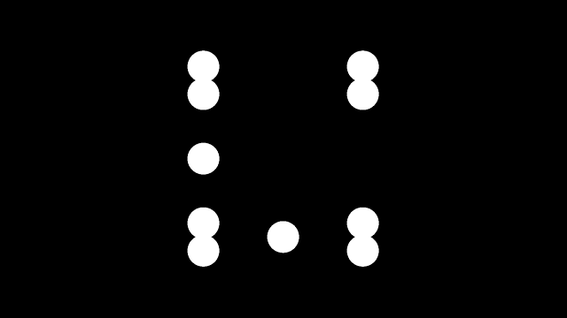
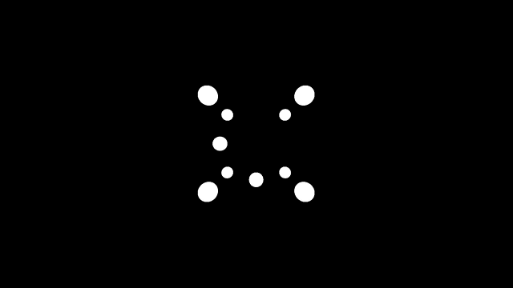

<div align="center">

# RayTracing

### *Project by Alberto Lazzeri, Riccardo Natale and Davide Riva*

Repository of "Tecniche Numeriche per la Generazione di Immagini Fotorealistiche" course by Professor Maurizio Tomasi (AY 2024/25). This code has been implemented in `Julia` and has the intent to create photorealistic images.

</div>

## DEMO
### DEMO SINGLE IMAGE

If `myraytracer/demo/` directory doesn't exist, in `myraytracer/` run:
```shell
mkdir demo
```

Then run:
```shell
julia demo.jl -t <n_threads> <camera_type> <angle>
```
where:
- `<n_threads> = auto` allows to use all available threads.
- `<n_threads> = 1` means not using multi-threading.

In `myraytracer/demo/` creates a `pfm` file and the corresponding `png` image.

### DEMO GIF




Before executing [demo_gif.jl](./demo_gif.jl), you need to install [ffmpeg](https://ffmpeg.org/):
- Ubuntu / Debian bash:
    ```shell 
    sudo apt install ffmpeg
    ```
- Windows prompt:
    ```shell
    choco install ffmpeg
    ```
- macOS bash:
    ```shell
    brew install ffmpeg
    ```

If `myraytracer/demo/` directory doesn't exist, in `myraytracer/` run:
```shell
mkdir demo
```

Now you can run:
```shell
julia -t <n_threads> demo_gif.jl <camera_type>
```
where:
- `<n_threads> = auto` allows to use all available threads.
- `<n_threads> = 1` means not using multi-threading.

A GIF file called `<camera_type>.gif` will appear in `myraytracer/`.

## CHECK CSG (*CONSTRUCTIVE SOLID GEOMETRY*)

If `myraytracer/CSG/` directory doesn't exist, in `myraytracer/` run:
```shell
mkdir CSG
```

Run:
```shell
julia -t <n_threads> check_csg.jl <camera_type> <angle_z> <angle_y>
```
where:
- `<n_threads> = auto` allows to use all available threads.
- `<n_threads> = 1` means not using multi-threading.

In `myraytracer/CSG/` creates a `pfm` file and the corresponding `png` image.

## DEMO (WITH PATHTRACING ALGORITHM)

If `myraytracer/` directory doesn't exist, in `myraytracer/` run:
```shell
mkdir demo_path
```

Then run:
```shell
julia -t <n_threads> demo_path.jl <camera_type> <angle_z> <angle_y>
```
where:
- `<n_threads> = auto` allows to use all available threads.
- `<n_threads> = 1` means not using multi-threading.